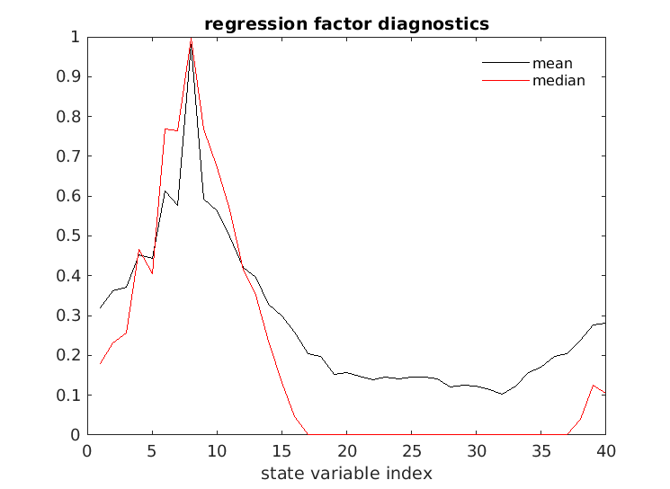
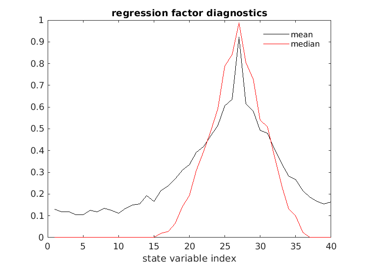

Localization
============

Localization algorithms are implemented by modifying the error
covariance matrices in order to prevent correlations at long distances
from being used by the filter. This process must be implemented with
care in order because localization can disrupt the geostrophic
balance in the model (e.g. Greybush et al. 2010 [1]_). 

Localization can have significant practical advantages -- after Jeff
Willison enabled vertical localization for SST in our setup (limiting
the influence of SST to the uppermost ~100m) the filter sped up by a
approximately a factor of three. Additionally, localization allows for
parallel processing.

The localization primer in `Section 13 of the DART Tutorial
<https://www.image.ucar.edu/DAReS/DART/Manhattan/documentation/tutorial/section_13.pdf>`_
uses Lorenz (1996) [2]_ as the example model for illustrating
localization. There's also an older set of `slides that Jeff Anderson
created in 2010 <https://www.image.ucar.edu/pub/DART/2010/2010_NY_JLA_talk.pdf>`_.

Working through Section 13 of the DART Tutorial:

.. parsed-literal::

    cd ~/DART/models/lorenz_96/work

Then edit ``input.nml`` to turn off localization, make 4 groups of 80 
members with no inflation and enable saving the regression diagnostics.

.. code-block:: fortran

    &assim_tools_nml
        cutoff               = 1000000.0,

    &filter_nml
        ens_size             = 80,
        num_groups           = 4,
        inf_flavor           = 0, 

    &reg_factor_nml
        save_reg_diagnostics = .true.,

Once ``input.nml`` is updated, build the executables and run filter. 

.. parsed-literal::

    ./quickbuild.csh
    ./filter
    matlab -nodesktop
    >> plot_reg_factor

The `documentation of the assim_tools_mod within DART
<https://www.image.ucar.edu/DAReS/DART/Manhattan/assimilation_code/modules/assimilation/assim_tools_mod.html>`_
specifically does not discuss theory behind localization and instructs
the reader to contact Jeff Anderson for more information.

Ying et al. (2018) [3]_ provide a longer treatment of the ideas
underlying localization using a two-layer QG model.

.. [1] Greybush, Steven J., Eugenia Kalnay, Takemasa Miyoshi, Kayo Ide, and Brian R. Hunt. “Balance and Ensemble Kalman Filter Localization Techniques.” *Monthly Weather Review* 139, no. 2 (October 5, 2010): 511–22. https://doi.org/10.1175/2010MWR3328.1.
.. [2] Lorenz, Edward N. “Predictability -- A Problem Partly Solved.” In Proceedings of a Seminar Held at ECMWF on Predictability, 1–18. Shinfield Park, UK: ECMWF, 1996.
.. [3] Ying, Yue, Fuqing Zhang, and Jeffrey L. Anderson. “On the Selection of Localization Radius in Ensemble Filtering for Multiscale Quasigeostrophic Dynamics.” *Monthly Weather Review* 146, no. 2 (January 4, 2018): 543–60. https://doi.org/10.1175/MWR-D-17-0336.1.
